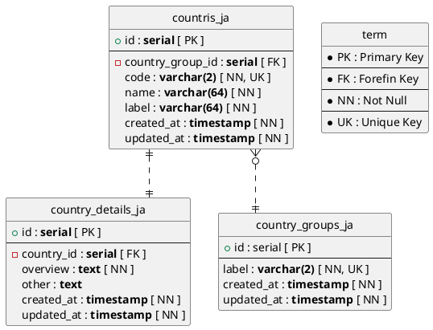
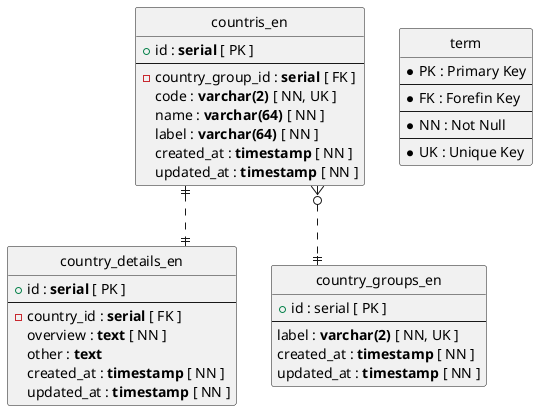

@import "./style.less"

<!---
To use the UML,  you need to
- Java(https://java.com/ja/)
- Graphviz(http://www.graphviz.org/download/)
- Vscode-Plantuml(https://github.com/qjebbs/vscode-plantuml)
- Markdown Preview Enhanced(https://shd101wyy.github.io/markdown-preview-enhanced/#/)
In order to use UML,  you need to install

HTML created with Markdown Preview Enhanced can be converted to JSX at this site.
(https://transform.tools/html-to-jsx)
-->

#### [**JA Lang Table**]

#### [**EN Lang Table**]
